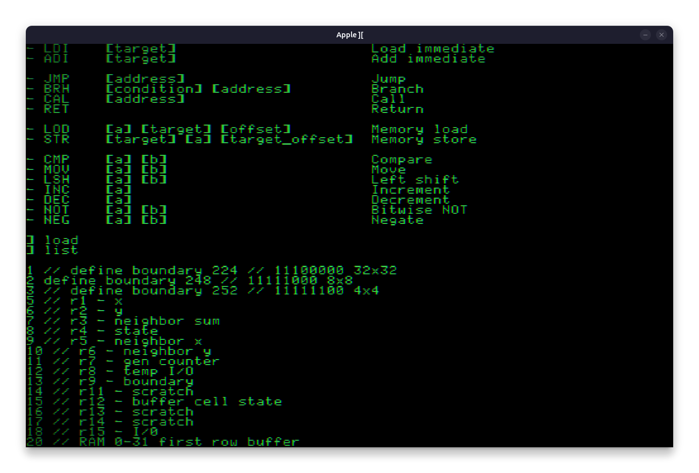

    <pre>
   _____________________           
  /                 `   \          
  |  .-----------.  |   |-----.    
  |  |           |  |   |-=---|    
  |  |  Apple][  |  |   |-----|    
  |  |           |  |   |-----|    
  |  |           |  |   |-----|    
  |  `-----------'  |   |-----'/\  
   \________________/___'     /  \ 
      /                      / / / 
     / //               //  / / /  
    /                      / / /   
   / _/_/_/_/_/_/_/_/_/_/ /   /    
  / _/_/_/_/_/_/_/_/_/_/ /   /     
 / _/_/_/_______/_/_/_/ / __/      
/______________________/ /         
\______________________\/          

‿୨♡୧‿
A retro BatPU-2 IDE
  </pre>

  
  
  

**Apple II** simulates a terminal environment inspired by classic retro computing, specifically resembling the Apple ][ terminal. It enables users to interact with a simple text-based programming interface, featuring a command-line interface (CLI) where lines of code can be entered, manipulated, and executed. Users can write, load, save, and manage simple programs using a set of commands while interacting with a pixelated grid display that mimics the look and feel of vintage terminals.

## Features
- **Command Interface**: Allows for writing, deleting, and editing lines of code.
- **Program Management**: Save, load, and list saved programs with options for handling files in memory.
- **Custom Cursor**: Various cursor styles (solid, frame, line) provide a nostalgic interaction style or modern and clean render.
- **Instruction Set**: Supports the custom instruction set architecture (ISA) of [BatPU-2](https://github.com/mattbatwings/BatPU-2) with commands for basic arithmetic, memory manipulation, branching, and more.
- **Interactive Grid**: A retro terminal grid that mimics the appearance of classic terminal systems.
- **User Commands**: Includes commands for managing the terminal's state such as:
  - `LIST`: Displays the current program.
  - `DEL`: Deletes a specified line from the program.
  - `SAVE` and `LOAD`: Save and load programs to/from files.
  - `HELP`: Provides assistance with available commands.

## Visual Style

The terminal's interface is rendered using a retro aesthetic, with pixelated fonts and a grid display that recalls vintage computing systems. The terminal screen size is set at 640x400 pixels, and the text is rendered with customizable fonts and colors for a nostalgic experience. A shader is used to mimic old screens using scanlines, a chromatic aberration and a vignette.

## To do
- [ ] Edit/Command modes
- [ ] Run the program
- [ ] Async lag while displaying terminal lines
- [ ] Startup screen and sound
- [ ] Settings (cursor, retro/lcd shader)
- [ ] Remove file
- [ ] Exit
